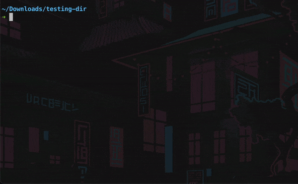

<div id="top"></div>

<!-- PROJECT HEADER -->
<br />

<div align="center">
   <a href="https://github.com/LeeTeng2001/my-git">
    
   </a>
   <h3 align="center">An Educational Version Control System</h3>
   <p align="center">
      A version control system like Git!
      <br />
      <a href="#Usage"><strong>Explore the examples »</strong></a>
      <br />
      <br />
      <a href="#Usage">View Demo</a>
      ·
      <a href="https://github.com/LeeTeng2001/my-git/issues">Report Bug</a>
   </p>
</div>

<!-- ABOUT THE PROJECT -->

## About The Project


Git is a useful version control tool we use daily, have you ever wonder about the algorithm behind it? This is my attempt at creating a small & functional version control tool like Git.

Main features:

* It's small, the whole codebase is around 2k lines
* You have all the core commands like `init`, `commit`, `status`, `restore` and so on.
* It's written in Java with some modern syntax
* It's compatible with some git files

I'm planning on writing an article about it, so stay tuned!

<p align="right">(<a href="#top">back to top</a>)</p>

<!-- GETTING STARTED -->

## Getting Started

### Prerequisites

You should have a working jdk distribution on your machine, I'm using OpenJDK17

* install openjdk with brew package manager (Mac)
  
  ```sh
  brew install java
  ```

### Installation

You can either build the project yourself or run the existing jar file

* Clone this repository and open the project in intellij, go to `build > build artifact > my-git`
* Or build using `maven build`
* Or run existing jar file
  ```sh 
  cd <project-directory>
  java -jar out/artifacts/my_git_jar/my-git.jar
  
  # For convenience, you could also setup an alias to the jar path like this
  alias git-run=java\ -jar\ <abs_path>/out/artifacts/my_git_jar/my-git.jar
  # and run the version control command like this
  git-run <some_command>
  ```

### Developing

You can directly run the maven project in Intellij or run the shell script `git-run.sh` and pass in corresponding arguments

  ```sh 
  cd <project-directory>
  chmod +x git-run
  ./git-run <some_command>
  ```

<p align="right">(<a href="#top">back to top</a>)</p>

<!-- USAGE EXAMPLES -->

## Usage

For every command and sub-commands you could specify `-h` or `--help` flag to show helps, for example:

```sh
➜ git-run -h
Usage: git [-hV] [COMMAND]
  -h, --help      Show this help message and exit.
  -V, --version   Print version information and exit.
Commands:
  init         Initialise a git repository with author name and email
  cat-file     Print content of git object
  hash-object  Compute object ID and optionally create blob file
  log          Display history from a given commit.
  ls-tree      Pretty-print a tree object.
  restore      Restore a commit inside of a directory. Caveat, doesn't restore
                 executable permission bit
  show-ref     List all references
  tag          Show tags or create a new tag for an object, usually pointing to
                 commit
  status       Show changes starting from directory, ONLY show changed files,
                 does not detect changes if content is the same
  commit       Save current state
```

Initialize a version control repository



Show version control status


Commit changes


_TODO: Add more examples_

<p align="right">(<a href="#top">back to top</a>)</p>


<!-- ROADMAP -->

## Roadmap

- [x] Write unit tests
- [ ] Add branching support
- [ ] Write an article


<p align="right">(<a href="#top">back to top</a>)</p>

<!-- LICENSE -->

## License

Distributed under the MIT License. See `LICENSE.txt` for more information.

<p align="right">(<a href="#top">back to top</a>)</p>

<!-- CONTACT -->

## Contact

Bryan Lee - leeteng2001@sjtu.edu.cn

<!-- Project Link: [https://github.com/your_username/repo_name](https://github.com/your_username/repo_name) -->

<p align="right">(<a href="#top">back to top</a>)</p>

<!-- ACKNOWLEDGMENTS -->

## Acknowledgments

Special thanks to the following resource

* [Git format documentation](https://github.com/git/git/tree/master/Documentation/technical)
* [MD Book](https://github.com/rust-lang/mdBook)
* [PicoCLI](https://picocli.info/)

<p align="right">(<a href="#top">back to top</a>)</p>

